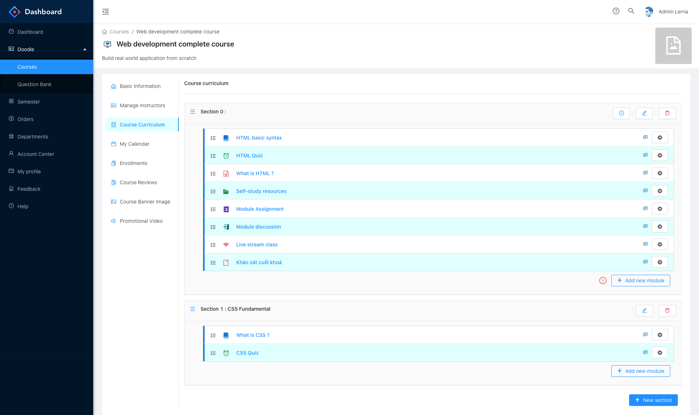
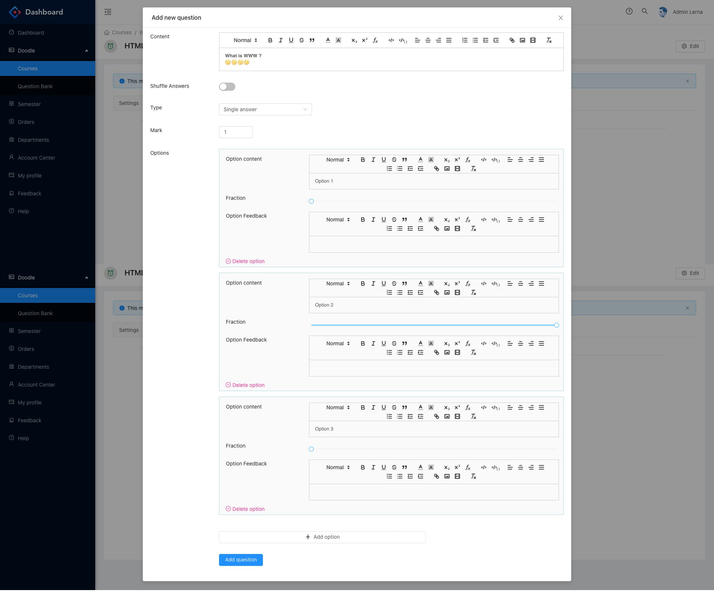
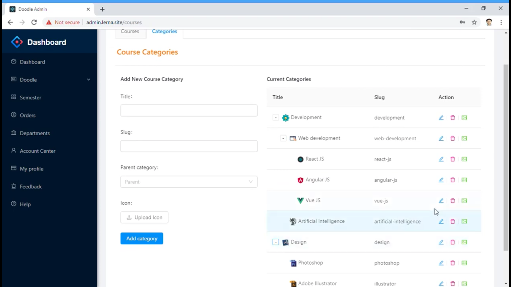
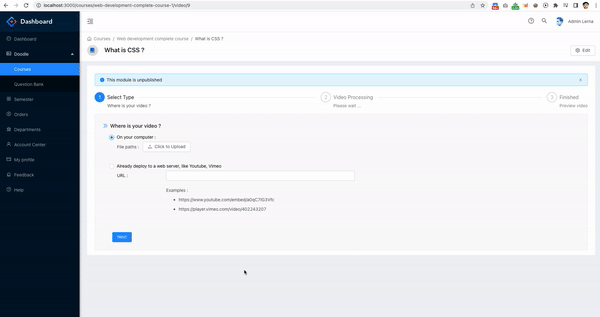

## About the project

**Lerna** is a learning management system, that support online learning and management.

This repository is about the administration page, which allow users (staff, teacher) to manage course curriculum, question bank, and other features.

## Preview

The live demo is not available for now, since we closed the backend instance, instead you can preview the project via [This video](https://www.youtube.com/watch?v=19s5P7ZJilI)

- **Manage course curriculum**:
  - We allow a variety type of modules including video, quiz, assignment, livestream class, ...

  - Quiz question create page

  - Manage Course Categories

  - Video upload process

## Technologies

- ReactJS
- Ant Design
- CSS Module
- Redux
- Others

